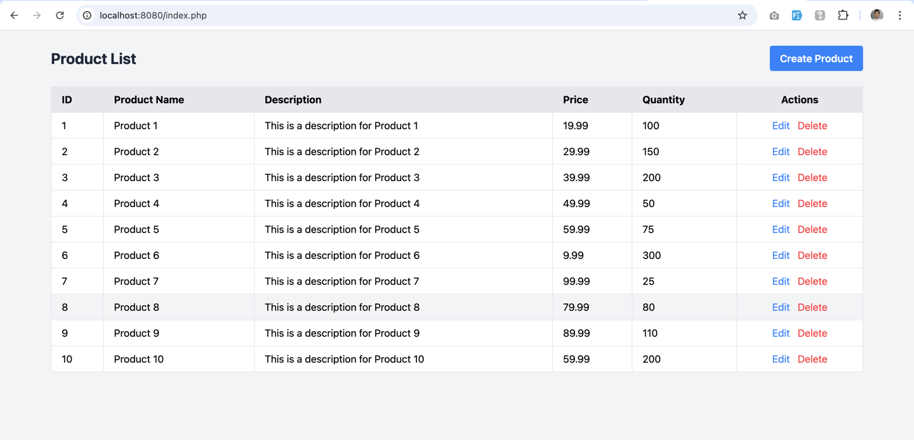
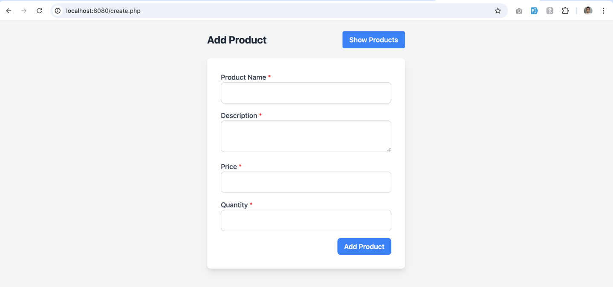
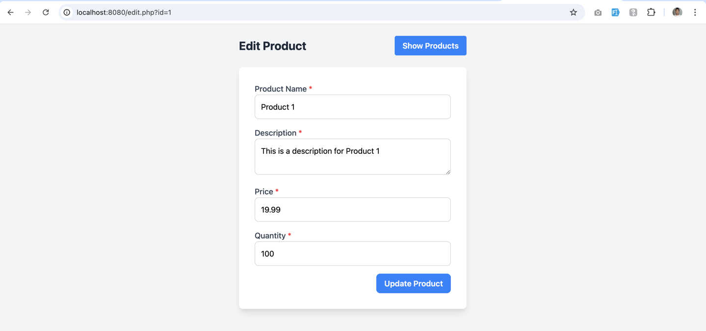

# Product Inventory

## Set 1: Basic CRUD Operations (Product Inventory)

This set of exercises focuses on building a basic product inventory management system using PHP and MySQL, covering the fundamental CRUD (Create, Read, Update, Delete) operations.

**1. Create a Database and Table**

*   Write a PHP script to create a database named `inventory_management` and a table named `products` with the following fields:
    *   `id` (integer, primary key, auto-incrementing)
    *   `product_name` (string)
    *   `description` (text)
    *   `price` (decimal)
    *   `quantity` (integer)

**2. Insert Data (Create)**

*   Create an HTML form to input `product_name`, `description`, `price`, and `quantity`.
*   Write a PHP script to insert this form data into the `products` table.

**3. Display Data (Read)**

*   Write a PHP script to retrieve and display all records from the `products` table in a user-friendly table format.

**4. Update Data (Update)**

*   Add an "Edit" option for each row in the displayed data.
*   When "Edit" is clicked, redirect to a form pre-populated with the current data for that product.
*   Write a PHP script to update the product record in the database based on the new input from the form.

**5. Delete Data (Delete)**

*   Add a "Delete" button for each row in the displayed data.
*   Write a PHP script that, when the "Delete" button is clicked, deletes the corresponding product record from the database.

# Screenshot

### Product List

### Create Product

### Edit Product

### Delete Product
